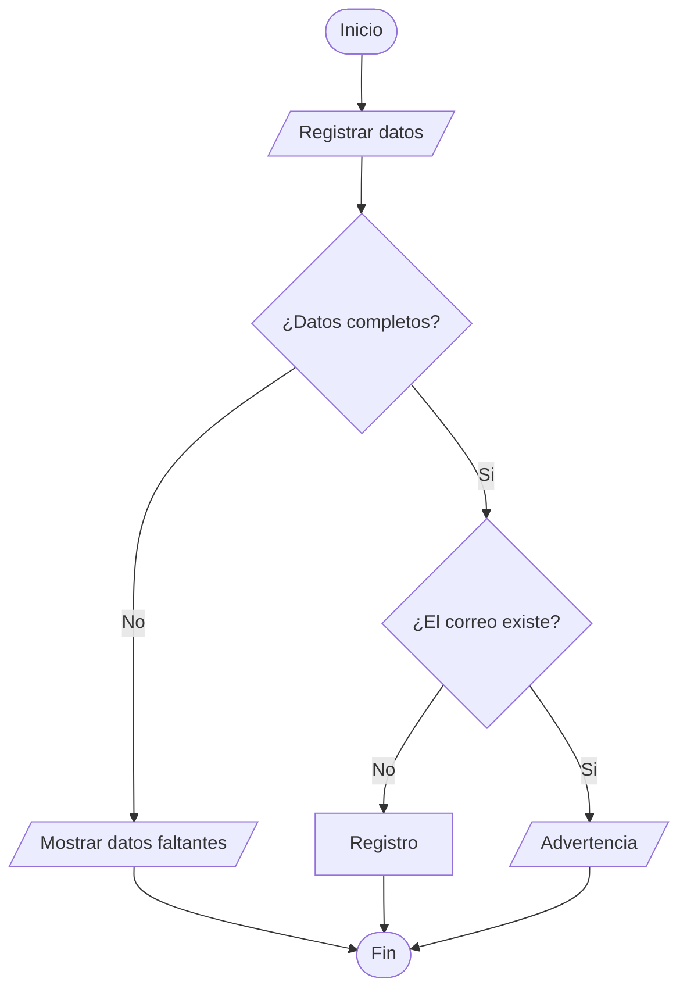

```mermaid
flowchart TB
    A([Inicio])--> B[/Registrar datos/]
    B-->C{¿Datos completos?}
    C-->|Si| D{¿El correo existe?}
    D-->|Si| H[/Advertencia/]
    D-->|No| E[Registro]
    C-->|No| F[/Mostrar datos faltantes/]
    F-->G
    E-->G([Fin])
    H-->G
```